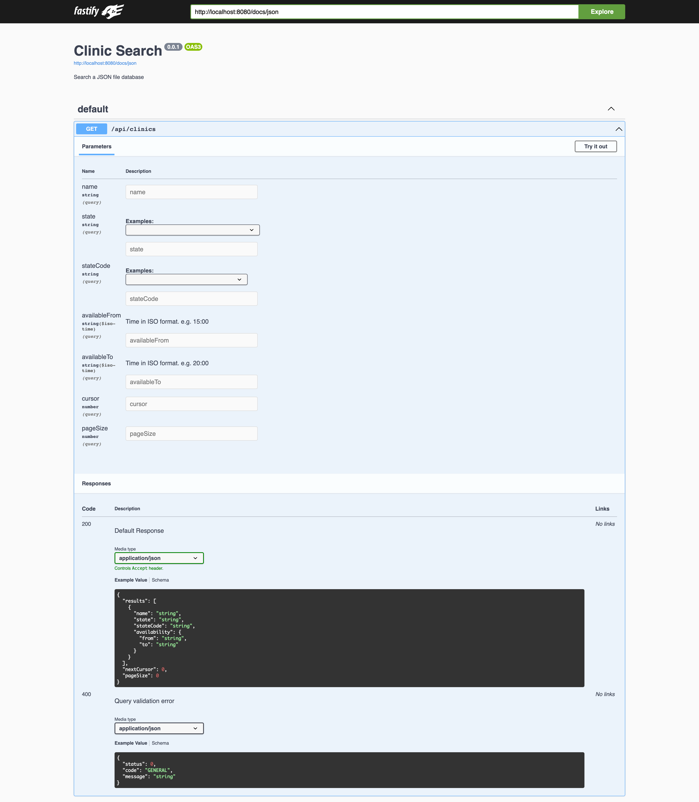
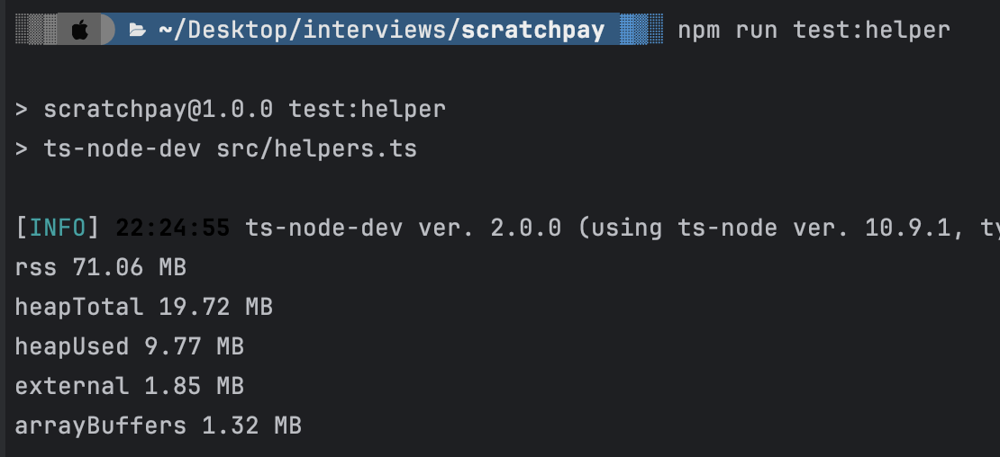
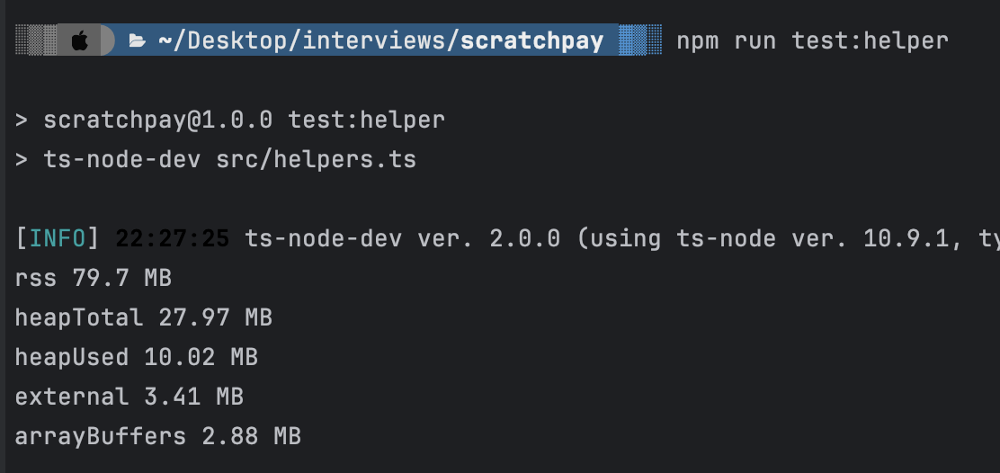
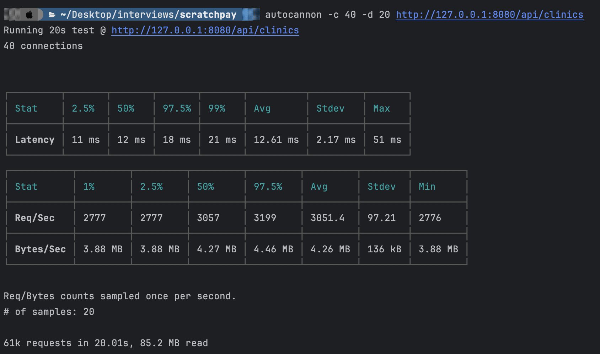

# Clinic Finder
A simple NodeJS application based on Fastify. It is written in typescript.

## Setup
- Copy `.env.sample` and rename it to `.env`.
- Make modifications to `.env` as you wish.
- Run `npm install`.

### Running the Node server locally

```shell
npm run dev
```

### To build the project

```shell
npm run build
```

### To start the project in production
You may want to run the application after being transpiled from Typescript to Javascript, hence, you should be able to 
start the project from the `build/src/index.js` by running:

```shell
npm run start
```

OR

You can also run with docker-compose by simple executing:

```shell
docker-compose up
```

Which ever way you decide to start the project, should you not encounter any error, the project should be running at 
http://0.0.0.0:8080.

## API Documentation

Swagger documentation is auto-generated for every new endpoint added to the project. You can access the docs 
at http://0.0.0.0:8080/docs once you are able to get the server running.




## Others

### Technical features
- Proper JSON logging
- Sensitive information such as Authorization details removed from logs
- Auto-generated swagger docs
- CORS configuration
- Validation of payload / query parameters

### Todo
- Add some indexing to the JSON for improved time complexity, it's only memory efficient right now.
- Write more unit / integration tests and with more data generated using fakerjs.
- Linting and formatting
- Precommit hooks to avoid committing untested code
- Configure Gitlab CI for CI/CD for lint checking, tests, coverage etc.


### Assumptions
- Newer records are added to the bottom of the json file store to avoid disrupting the order of pagination.

## Performance
### Memory usage
The is consistent with memory usage even with large datasets as the datasets are streamed in chunks into memory as opposed 
to loading them all at once.

#### Memory usage for:

- 1mb of JSON 



- 4mb of JSON 


### Time complexity
Currently, the worst case scenario is O(n) as the data is not being indexed. The time spent searching through data increases 
linearly as the number of records increases. A good solution would be to create indexes for the clinic so that there's some 
extra data stored elsewhere that is able to track the read offset of each clinic in the list by the name, times and states.  

#### Throughput
With the current sample data, the application is approximately able to handle 3k req/s. I do not expect this to be same 
with increasing data as mentioned in the previous section, but improvement that can be made are suggested in the Todo. 

